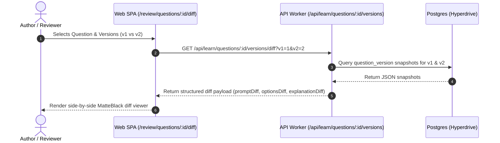
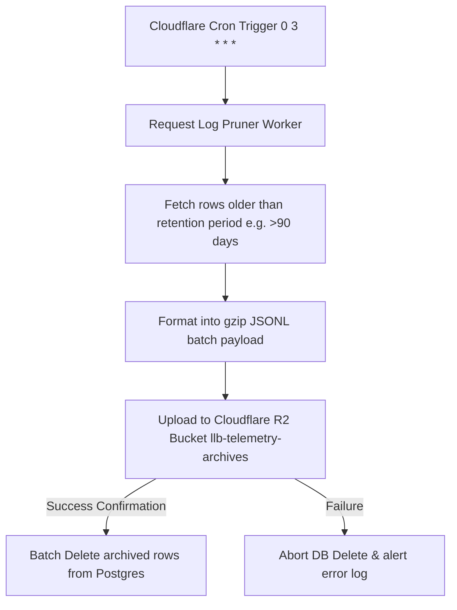
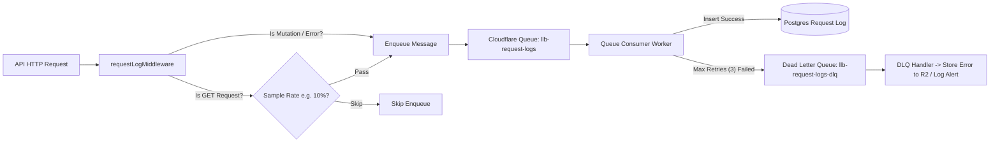

# Advanced Infrastructure & Product Specification

This document details the architectural design, API endpoints, schema structures, and execution steps for implementing:
1. **Question Versioning UI & Visual Diff Viewer** (Point 2)
2. **Cloudflare R2 Telemetry Archival** (Point 3)
3. **Queue Dead-Letter Queue (DLQ) & Traffic Sampling** (Point 4)

---

## 1. Question Versioning UI & Visual Diff Viewer

### 1.1 Objective
Provide content authors and community reviewers with a side-by-side diff viewer to compare historical question revisions (`question_version` table) directly in the Web UI.

### 1.2 Architecture & Flow



### 1.3 API Contract

#### `GET /api/learn/questions/:id/versions/diff?v1=:v1&v2=:v2`
- **Response**:
```json
{
  "questionId": "q-123",
  "v1": 1,
  "v2": 2,
  "diff": {
    "title": { "old": "Old Title", "new": "New Title", "changed": true },
    "prompt": [
      { "value": "Given an array of ", "added": false, "removed": false },
      { "value": "unsigned integers", "added": true, "removed": false },
      { "value": "integers", "added": false, "removed": true }
    ],
    "explanation": [ ... ],
    "difficulty": { "old": "beginner", "new": "intermediate", "changed": true }
  }
}
```

### 1.4 Web Component Specification (`QuestionDiffViewer.tsx`)
- Highlighting deletions with Crimson Red (`--danger` / `#DC2626`) and background (`--danger-bg` / `#2A1212`).
- Highlighting insertions with Emerald Green (`--success` / `#10B981`) and background (`--success-bg` / `#0F241C`).
- Rendered within elevated MatteBlack cards (`--surface-2` / `#212121`).

---

## 2. Cloudflare R2 Telemetry Archival

### 2.1 Objective
Automatically compress and archive historical `request_log` entries to Cloudflare R2 object storage before hard-deleting them from Postgres via the daily pruner worker.

### 2.2 System Architecture



### 2.3 Object Storage Naming Scheme
Objects are organized in R2 by year, month, and day for fast analytical querying:

```text
llb-telemetry-archives/
  └── request_logs/
      └── year=2026/
          └── month=08/
              └── day=16/
                  └── batch_1786921200_count_5000.jsonl.gz
```

### 2.4 Code Implementation (`request-log-pruner.ts` with R2 Archival)

```ts
import { sql } from "drizzle-orm";
import { createDb } from "../db/index.ts";

export async function archiveAndPruneRequestLogs(
  env: CloudflareBindings,
  retentionDaysOverride?: number,
): Promise<{ archivedCount: number; deletedCount: number }> {
  const retentionDays =
    retentionDaysOverride ?? (Number(env.REQUEST_LOG_RETENTION_DAYS || "90") || 90);

  const db = createDb(env.HYPERDRIVE);
  let totalArchived = 0;
  const batchSize = 5000;

  try {
    // 1. Fetch batch to archive
    const oldRows = await db.execute(sql`
      SELECT * FROM request_log
      WHERE created_at < NOW() - (${retentionDays} || ' days')::INTERVAL
      ORDER BY created_at ASC
      LIMIT ${batchSize}
    `);

    if (!oldRows.rows || oldRows.rows.length === 0) {
      return { archivedCount: 0, deletedCount: 0 };
    }

    // 2. Format as JSONL payload
    const jsonl = oldRows.rows.map((row) => JSON.stringify(row)).join("\n");
    const timestamp = Math.floor(Date.now() / 1000);
    const dateStr = new Date().toISOString().slice(0, 10);
    const [year, month, day] = dateStr.split("-");
    const r2Key = `request_logs/year=${year}/month=${month}/day=${day}/batch_${timestamp}_count_${oldRows.rows.length}.jsonl`;

    // 3. Upload to R2 Bucket if binding exists
    if (env.R2_TELEMETRY_BUCKET) {
      await env.R2_TELEMETRY_BUCKET.put(r2Key, jsonl, {
        httpMetadata: { contentType: "application/x-ndjson" },
        customMetadata: {
          rowCount: String(oldRows.rows.length),
          retentionDays: String(retentionDays),
        },
      });
      console.log(`[R2 Archival] Successfully stored ${oldRows.rows.length} rows to ${r2Key}`);
    }

    // 4. Safely delete archived rows from DB
    const ids = oldRows.rows.map((r: any) => r.id);
    const deleteResult = await db.execute(sql`
      DELETE FROM request_log WHERE id = ANY(${ids})
    `);

    totalArchived = Number(deleteResult.rowCount ?? oldRows.rows.length);
    return { archivedCount: totalArchived, deletedCount: totalArchived };
  } catch (err) {
    console.error("[R2 Archival Error]", err);
    return { archivedCount: 0, deletedCount: 0 };
  }
}
```

---

## 3. Queue Dead-Letter Queue (DLQ) & Traffic Sampling

### 3.1 Objective
1. **Dead-Letter Queue (DLQ)**: Capture and isolate failed `request_log` messages after 3 failed delivery attempts to prevent telemetry queue stalling.
2. **Traffic Sampling Engine**: Guarantee 100% logging of all state mutations (`POST`, `PUT`, `DELETE`) and HTTP errors (`4xx`/`5xx`), while intelligently sampling read-only `GET` traffic under heavy load.

### 3.2 System Architecture & Flow



### 3.3 Traffic Sampling Middleware (`request-log-middleware.ts`)

```ts
import type { MiddlewareHandler } from "hono";

function shouldSampleRequest(method: string, statusCode: number, sampleRate = 0.10): boolean {
  // Always log state-changing mutations and error responses (4xx, 5xx)
  if (method !== "GET" || statusCode >= 400) {
    return true;
  }
  // Sample read-only GET requests
  return Math.random() < sampleRate;
}

export const requestLogMiddleware: MiddlewareHandler<{ Bindings: CloudflareBindings }> = async (c, next) => {
  const started = Date.now();
  await next();

  if (!shouldSampleRequest(c.req.method, c.res.status)) {
    return;
  }

  const payload = {
    method: c.req.method,
    path: c.req.path,
    statusCode: c.res.status,
    latencyMs: Date.now() - started,
    createdAt: new Date().toISOString(),
  };

  try {
    await c.env.REQUEST_LOGS_QUEUE.send(payload);
  } catch (err) {
    console.error("Failed enqueueing log payload", err);
  }
};
```

### 3.4 Wrangler Configuration (`wrangler.jsonc`)

```jsonc
{
  "queues": {
    "producers": [
      { "binding": "REQUEST_LOGS_QUEUE", "queue": "llb-request-logs" }
    ],
    "consumers": [
      {
        "queue": "llb-request-logs",
        "max_batch_size": 25,
        "max_batch_timeout": 5,
        "max_retries": 3,
        "dead_letter_queue": "llb-request-logs-dlq"
      },
      {
        "queue": "llb-request-logs-dlq",
        "max_batch_size": 10,
        "max_batch_timeout": 10
      }
    ]
  },
  "r2_buckets": [
    {
      "binding": "R2_TELEMETRY_BUCKET",
      "bucket_name": "llb-telemetry-archives"
    }
  ]
}
```

---

## 4. Execution Roadmap

| Step | Component | Action | Verification |
| :--- | :--- | :--- | :--- |
| **Phase 1** | Question Version Diff | Add `/api/learn/questions/:id/versions/diff` route & `QuestionDiffViewer.tsx` component | Unit test diff comparison output for prompt & code snippet changes |
| **Phase 2** | Cloudflare R2 Bucket | Provision `R2_TELEMETRY_BUCKET` in `wrangler.jsonc` & update `archiveAndPruneRequestLogs` | Verify `.jsonl` object creation in R2 on scheduled cron trigger run |
| **Phase 3** | DLQ & Sampling | Update `wrangler.jsonc` queue consumer specs & add `shouldSampleRequest` logic | Test max retry fallback routing to `llb-request-logs-dlq` consumer |
