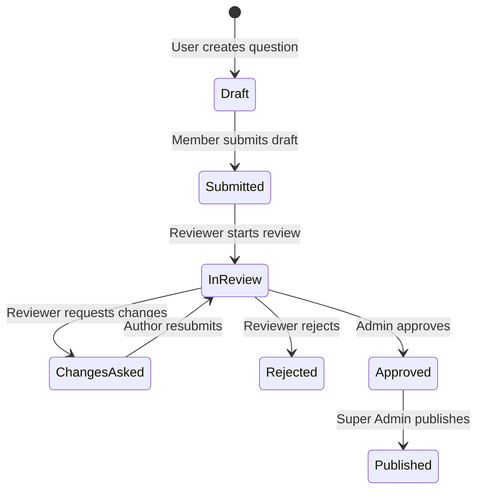

# Low Level Lab — UI Overhaul Master Implementation Plan

> **Design Direction**: *"Low Level Lab, reset as a reference manual"*
> **Source Specification**: `PDF Gallery_20260914_094519.pdf` (50 Pages, 17 Unique Design Sheets)

---

## 1. Executive Summary & Design Philosophy

The Low Level Lab UI overhaul transitions the platform from a generic modern rounded SaaS look to an **authoritative technical reference manual**.

### Core Design Rules (from Sheet 1 & Sheet 17)
1. **Structure comes from hairlines, never from shadows or rounded cards**:
   - `1px solid hairline borders` replace dropped shadows, rounded elevation boxes, and soft gradient backgrounds.
   - Corners are sharp or minimally rounded (`0px` to `2px` max).
2. **Numbers are always mono and tabular**:
   - Numeric stats, memory addresses, byte strides, timing cycles, and question counts use `IBM Plex Mono` (or `ui-monospace`) with tabular numeric alignment so columns align perfectly.
3. **Index Blue means one thing only**:
   - `#1F3FD8` (Light) / `#6E8BFF` (Dark) signifies **"you are here"** or **"solved"**. It is strictly reserved for active states, link indicators, and current position tracking.
4. **Gold belongs to the identity, never to the interface**:
   - `#EDE55B` (Dark) darkens to `#A8791C` on paper so it is visible. Gold highlights identity markers, brand tags, and active address space indicators (e.g. current stack frame).

---

## 2. Design System Tokens & Color Palette

### 2.1 Color Tokens

| Token Name | Light Mode (Paper) | Dark Mode (Ground) | Usage & Intent |
| :--- | :--- | :--- | :--- |
| **Canvas / Background** | `#EDEDE7` (`Paper`) | `#14171C` (`Ground`) | Base application background |
| **Raised Surface** | `#E4E4DC` (`Paper, sunk`) | `#1B1F26` (`Ground, raised`) | Cards, sidebar rail, sunk panels |
| **Primary Ink / Text** | `#14171C` (`Ink`) | `#EDEDE7` (`Ink, reversed`) | Primary headings, body text |
| **Index Blue** | `#1F3FD8` (`Index blue`) | `#6E8BFF` (`Index blue, lifted`)| Active selection, solved badges, active nav |
| **Marker / Gold** | `#EDE55B` / `#A8791C` | `#EDE55B` | Brand identity, stack frame highlight |
| **Hairline Rule** | `#C7C7B2` (`Rule`) | `#2E343C` (`Rule`) | 1px border lines across grids and tables |
| **Muted Text** | `#66665E` | `#999990` | Subtitles, metadata, timestamps |

### 2.2 Typography Scale

- **Serif (Headings, Standfirsts, Body)**: `Spectral` (Google Font)
  - `Spectral 600 / 50pt`: Screen Titles & Page Headers (*"Caches and locality"*, *"Seventy-seven solved"*)
  - `Spectral 400 / 19pt Italic`: Question Standfirsts & Section Subtitles (*"A standfirst carries the question's shape"*)
  - `Spectral 400 / 17pt`: Reader Body Prose (Leaded for long technical reading, max 64 chars per line)
- **Monospace (Data, Code, Address Space, Metrics)**: `IBM Plex Mono`
  - `IBM Plex Mono 500 / 44pt`: Hero Metrics & Big Counters (*"248"*, *"3,412"*)
  - `IBM Plex Mono 400 / 11pt`: Memory Hex Addresses (`0xFFFF`, `0xFF20`), Tabular Counts, Strides, Timestamps

### 2.3 Dual Favicon Icon System (Sheet 9 Specification)
- **`icon.svg`** (32px and above): Detailed 3-leg IC illustration with shaded case and rounded tile.
- **`favicon-16.svg`** (16px browser tabs): Simplified 2-leg IC flat silhouette with square tile and heavier strokes.
- **Theme Adaptation**: Both SVGs include `@media (prefers-color-scheme: dark)` inside the SVG code so tab tiles automatically adapt to dark/light browser chrome without dark square artifacts.

---

## 3. Screen-by-Screen Breakdown & UI Requirements

### Sheet 1: Design System Foundations
- Palette swatch documentation for light (`#EDEDE7`) and dark (`#14171C`) themes.
- Hairline-only layout rules, typography guidelines, and blue/gold usage rules.

### Sheet 2: Dashboard ("Where you left off, and what the map looks like")
- **Top Hero Header**: *"You left off inside the stack frame."* with callout on open calling convention questions.
- **Interactive Memory Space Diagram Widget**:
  - `0xFFFF` `stack` (grows down)
  - `0xFF20` `frame: parse()` **[you are here]** (Gold `#EDE55B` highlight)
  - `0x7A00` `mmap` (shared libs)
  - `0x4100` `heap` (grows up)
  - `0x2000` `.bss / .data` (statics)
  - `0x0400` `.text` (your code)
- **Three Stat Counters**:
  - `77/248` Questions solved (31% of bank)
  - `6/9` Topics opened
  - `12` Days running (Streak)
- **Two Column Layout**:
  - Left: *"Pick up where you left off"* list of active questions.
  - Right: *"Topics"* summary list with progress counts (`01 Memory and pointers (23/37)`, `02 Caches and locality (11/27)`).

### Sheet 3: Questions Bank ("The bank, as a table of contents")
- Top search input bar (*"Search questions, topics, syscalls"*).
- Topic filter tabs (`All topics`, `Memory`, `Caches`, `Concurrency`, `Syscalls`).
- Difficulty filter buttons (`Any difficulty`, `Easy`, `Medium`, `Hard`).
- Hairline table view of questions with ID, Title, Subtitle excerpt, Topic tag, and Difficulty badge.
- *"Load 20 more"* pagination trigger.

### Sheet 4: Topic View ("One area, its shape and its questions")
- Header with back navigation (`< Back to topics`) and topic counter (`Topic 02 of 09`).
- **Hardware Latency Matrix Widget**:
  - `L1 Cache`: 4 cycles (32 KB)
  - `L2 Cache`: 14 cycles (512 KB)
  - `L3 Cache`: 60 cycles (16 MB)
  - `DRAM`: 220 cycles **[where you lose]** (Gold highlighted row)
- **3 Topic Metric Counters**: Questions count (27), Solved by user (11), Subtopics count (6).
- **Subtopics Taxonomy Grid**: `a Cache lines`, `b Associativity`, `c Prefetching`, `d False sharing`, `e TLB and pages`, `f NUMA`.
- Scoped questions list with difficulty pills.

### Sheet 5: Question Reader View ("The reading view, with metadata pushed into the margin")
- **Left Margin Metadata Sidebar**:
  - Question ID (`Question 096`), Topic, Subtopic, Difficulty (`Hard`), Estimated Time (`8 minutes`), Solved count (`212 solved`), Author & Date (`A. Mehta, March 2026`).
- **Main Reading Content Pane**:
  - Title: *"Two threads, two variables, one slow program"*
  - Standfirst: Spectral italic 19pt text summarizing the core problem.
  - Drop-Cap *"S"*: Initial paragraph styled with drop cap.
  - Code Block: Monospace C code snippets demonstrating cache line sharing.
  - Callout box with left accent border describing hardware coherence invalidation.
- **Action Footer Bar**: `[Reveal the answer]` | `[Mark as solved]` | `[Next: 097, memory barriers]`.

### Sheet 6: Progress Ledger ("A ledger, not a trophy case")
- Title: *"Seventy-seven solved, eight months in."*
- **60-Day Activity Heatmap Grid**: Monospace contribution-style intensity matrix (0 to 5+ solved).
- **Key Metrics**: Solved total (77), Median solve time (6.4m), Day streak (12).
- **By Topic Ledger Table**: Columns: Topic, Last opened, Solved, Of, Share %.

### Sheet 7: Analytics ("For people who publish questions")
- Period selector (`Last 30 days` | `Your 14 published questions`).
- **3 Top KPIs**: Reads (3,412), Solved after reading (61%), Saved for later (28).
- **Daily Reads Line Chart**: 30-day interactive SVG trend line.
- **Question Performance Table**: Reads, Solved %, Median completion time.

### Sheet 8: Profile ("Plus the empty state, which is a screen too")
- Signed in user banner (`md.sohail`).
- User profile info card: Name, Bio, Email, OpenFGA Role (`Author, can publish questions`), Joined date, Session count.
- Saved for later section with empty state callout (`Browse questions`).
- Standing sidebar metrics: Solved total, Written total, Streak length.

### Sheet 9: Iconography & Tab Favicons
- Full SVG specification for 16px flat favicon and 32px detailed app icon.

### Sheets 10 - 13: Authentication & Question Authoring
- **Sign In (Sheet 10)**: Left side memory stack diagram + right side credentials form & OAuth buttons.
- **Create Account (Sheet 11)**: Left side topic/pricing breakdown + right side registration form.
- **Reset Password (Sheet 12)**: 3-step vertical progress rail (`1 request`, `2 sent`, `3 new password`) + password update form with mismatch alert.
- **Write Question (Sheet 13)**: Split-screen dense draft editor (Title, Slug, Type tabs: `Single choice`, `Multiple`, `True/false`, `Math`, `Code output`, `AI graded`, Topic dropdown, Body textarea) with real-time reader preview pane.

### Sheets 14 - 17: Content Management & OpenFGA Governance
- **Manage Topics (Sheet 14)**: Existing topics table + new topic creation form + inline edit modal drawer.
- **Reviewer Queue (Sheet 15)**: Filter tabs (`draft`, `submitted`, `in_review`, `approved`, `published`). Items waiting review with `Start review`, `Request changes` (opens drawer), `Reject`.
- **Admin Queue (Sheet 16)**: Two-stage approval workflow (`Approve` then `Publish`). Approval notification banner explaining the release policy.
- **Roles & OpenFGA Tuples (Sheet 17)**: OpenFGA assigned tuples table (`Relation`, `User`, `Object`), Assign Role form with error state (`That user already holds reviewer on workspace:111`), and Role Capability Reference Matrix.

---

## 4. Workflows & State Machine Architecture

### OpenFGA Permission Matrix

| Role | Scope | Key Capabilities |
| :--- | :--- | :--- |
| `member` | `workspace:111` | Read questions, answer, write & submit drafts |
| `reviewer` | `topic:<topic-name>` | Start review, request changes, reject questions within assigned topic |
| `admin` | `workspace:111` | Approve questions, edit topics, manage question queue |
| `super_admin` | `workspace:111` | Publish approved questions, assign OpenFGA role tuples |

---

## 5. Migration Plan & Implementation Steps

### Phase 1: CSS Design Tokens & Typography Integration
1. Update `src/index.css` with CSS custom variables for Paper (`#EDEDE7`), Ground (`#14171C`), Hairline Rule (`#C7C7B2` / `#2E343C`), Index Blue (`#1F3FD8` / `#6E8BFF`), and Gold (`#EDE55B` / `#A8791C`).
2. Add Google Fonts import for `Spectral` and `IBM Plex Mono` to `index.html` / `src/index.css`.
3. Configure Tailwind font families and utility rules for hairline borders (`border-rule`).

### Phase 2: Core Layout & Navigation Component (`AppLayout.tsx` & `Sidebar.tsx`)
1. Overhaul `Sidebar.tsx` to mirror the Side Rail from the specification:
   - 3-pin IC logo brand header.
   - Nav sections: **Study**, **Contribute**, **Account**.
   - Badge counters on `Questions [248]` and `Review queue [4]`.
2. Ensure strict light/dark theme toggle matching PDF color tokens.

### Phase 3: Interactive Widgets & Page Overhauls
1. Build `MemorySpaceWidget.tsx` for the Dashboard and Sign In pages.
2. Build `HardwareLatencyWidget.tsx` for Topic Detail page.
3. Overhaul `DashboardPage.tsx`, `QuestionsPage.tsx`, `TopicDetailPage.tsx`, `QuestionDetailPage.tsx`, `ProgressPage.tsx`, `AnalyticsPage.tsx`, and `ProfilePage.tsx`.
4. Implement Question Reader margin sidebar with drop-cap and italic standfirst typography.

### Phase 4: Auth, Content & Governance Overhauls
1. Redesign `AuthPage.tsx` and `ResetPasswordForm.tsx` to include the stack diagram visual and 3-step indicator.
2. Build `ContentManagementPage.tsx` tabs: `Manage Topics`, `Reviewer Queue`, `Admin Queue`, and `OpenFGA Roles`.
3. Implement 2-stage approval workflow UI (`Approve` -> `Publish`).

---

## 6. Verification & Verification Commands

1. Typecheck and build verification: `pnpm build`
2. ESLint code cleanliness verification: `pnpm lint`
3. Wrangler deployment dry run: `pnpm exec wrangler deploy --dry-run --config wrangler.jsonc`
