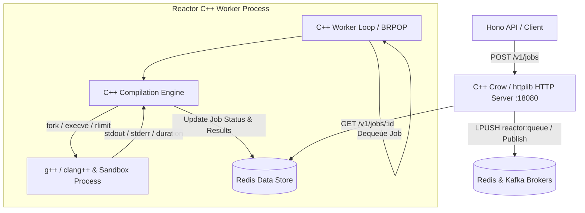

# C++ Native Reactor Engine Migration Specification

## 1. Objective
Refactor the **Reactor** execution service in `reactor/` into a 100% C++ native codebase. This replaces the node/TypeScript bridge in `reactor/service/` with a high-performance C++20 REST service, worker execution engine, and native Redis/Kafka integration while preserving all API endpoints, environment variables, and Docker container behavior.

---

## 2. Target Architecture



---

## 3. Technology Stack & Dependencies

| Component | Current (Node.js/TS) | Native C++ Target |
| :--- | :--- | :--- |
| **Language** | TypeScript (Node.js 20) | C++20 (`std::c++20`) |
| **Build System** | `npm` / `esbuild` | CMake 3.20+ (`g++-13` / `clang++-17`) |
| **HTTP Server** | Hono (`@hono/node-server`) | `cpp-httplib` or `Crow` |
| **JSON Serialization**| Native JS `JSON.parse`/`stringify` | `nlohmann/json` |
| **Redis Integration** | `ioredis` | `redis-plus-plus` (`sw::redis`) with `hiredis` |
| **Kafka Integration** | `kafkajs` | `cppkafka` / `librdkafka` |
| **Logging** | `console.log` | `spdlog` (asynchronous JSON/console) |
| **Testing** | None | GoogleTest (`GTest`) |

---

## 4. Pure C++ Repository Layout

```text
reactor/
├── CMakeLists.txt                  # Root CMake configuration (C++20, targets, dependencies)
├── Dockerfile                      # Multi-stage C++ build (g++/clang++, CMake, hiredis, librdkafka)
├── README.md                       # Build and run instructions
├── CPP_MIGRATION_SPEC.md           # This specification document
├── include/                        # Public headers
│   └── reactor/
│       ├── compiler.hpp            # C++ compiler execution worker
│       ├── http_server.hpp         # REST API server controller
│       ├── kafka_worker.hpp        # Kafka consumer & producer background thread
│       ├── redis_client.hpp        # Redis queue & job state manager
│       ├── types.hpp               # Job models & JSON serialization DTOs
│       └── utils.hpp               # Process execution, UUID generator, system helpers
├── src/                            # Implementation files
│   ├── main.cpp                    # Service entry point & signal handling
│   ├── compiler.cpp                # Process fork/exec, timeout & resource limit logic
│   ├── http_server.cpp            # HTTP routes (/health, POST /v1/jobs, GET /v1/jobs/:id)
│   ├── kafka_worker.cpp           # Kafka worker consumer loop
│   ├── redis_client.cpp           # Redis commands implementation
│   └── utils.cpp                   # System utilities
└── tests/                          # C++ GoogleTest suite
    ├── test_main.cpp
    ├── test_compiler.cpp
    └── test_job_queue.cpp
```

---

## 5. Feature & Specification Breakdown

### 5.1 HTTP API Specifications (Identical Port `:18080`)
1. **`GET /health`**
   - Returns `{ "ok": true }` with status code 200.
2. **`POST /v1/jobs`**
   - **Request Body**: `{ "language": "cpp", "source": "#include <iostream>..." }`
   - **Validations**: Max source size = 200,000 bytes. Language must be `"cpp"`.
   - **Response**: `{ "id": "<uuid>", "status": "queued" }` (201 Created).
   - **Action**: Persists job document in Redis, pushes ID to `reactor:queue`, and publishes to Kafka if available.
3. **`GET /v1/jobs/:id`**
   - **Response**: `{ "id": "<uuid>", "status": "succeeded"|"failed"|"timed_out"|"queued"|"running", "result": { "stdout": "...", "stderr": "...", "exitCode": 0, "compiler": "clang++", "durationMs": 42 }, "createdAt": "...", "updatedAt": "..." }`

### 5.2 Compiler Sandbox Engine (`compiler.cpp`)
- Locates `clang++` or `g++` via `PATH` lookup.
- Creates isolated temporary directory (`/tmp/llb-reactor-XXXXXX`).
- Writes `main.cpp` and invokes compiler: `${compiler} -std=c++17 -O0 main.cpp -o a.out`.
- Sets compilation timeout (15s) and execution timeout (3s) using non-blocking process polling (`waitpid` with `WNOHANG` or `select`/`epoll` on stdout/stderr pipes).
- Enforces strict resource limits via POSIX `setrlimit` (CPU time limit, file size limit, process count limit).

### 5.3 Queue & Event Workers (`redis_client.cpp`, `kafka_worker.cpp`)
- **Redis Worker Loop**: Runs `BRPOP reactor:queue 5` in background thread.
- **Kafka Worker Loop**: Consumes topic `reactor-jobs` using `cppkafka` / `librdkafka`.
- Atomically updates status in Redis: `queued` → `running` → `succeeded` / `failed` / `timed_out`.

---

## 6. Deprecation & File Cleanup Plan

1. **Delete Node.js/TypeScript Folder**:
   - `rm -rf reactor/service/`
2. **Update `docker-compose.yml`**:
   - Change `reactor` build context from `./reactor/service` to `./reactor` with standard C++ `Dockerfile`.

---

## 7. Step-by-Step Implementation Roadmap

| Phase | Task | Deliverable |
| :--- | :--- | :--- |
| **Phase 1** | Types & System Process Execution | `types.hpp`, `compiler.hpp`, `compiler.cpp`, `utils.cpp` |
| **Phase 2** | Redis & Kafka C++ Clients | `redis_client.hpp/cpp`, `kafka_worker.hpp/cpp` |
| **Phase 3** | C++ REST HTTP Server | `http_server.hpp/cpp`, `main.cpp` |
| **Phase 4** | CMake & Dockerfile Refactoring | `CMakeLists.txt`, `Dockerfile`, `docker-compose.yml` update |
| **Phase 5** | Verification & Unit Tests | `GTest` execution & HTTP submission validation |
